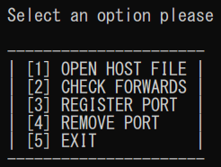

# localDomains
Manage local domains for local web develop on Windows OS. If you just start to add your first one follow the options in sequence without option number 4. It uses [netsh](https://en.wikipedia.org/wiki/Netsh) in order to manage the forwarding.
## 
# Usage
Download `localDomains.bat`, open it and select an option.
> **It opens as administrator in automatic so you'll need admin access!**
